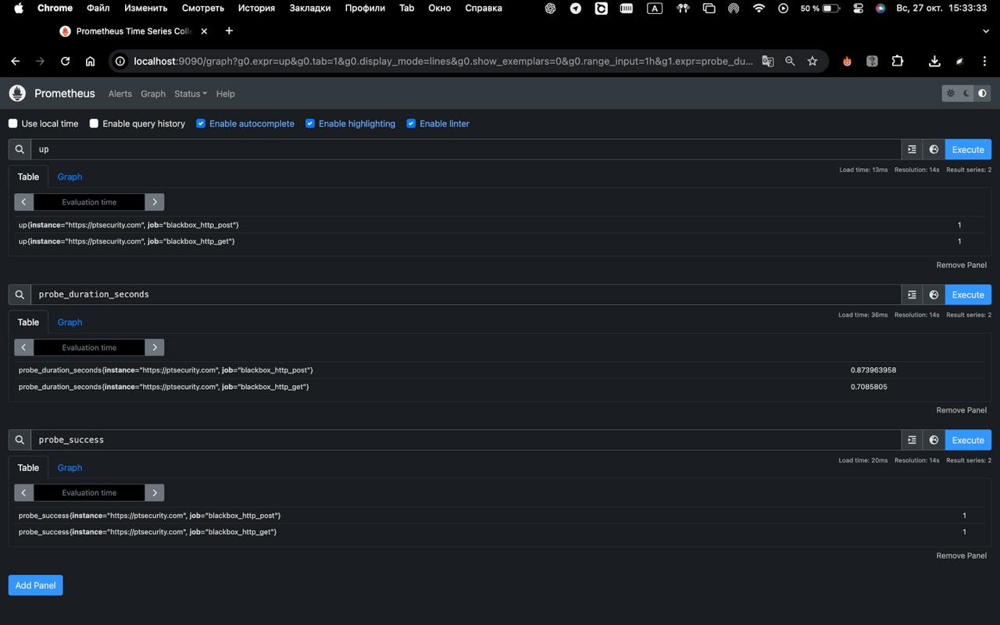
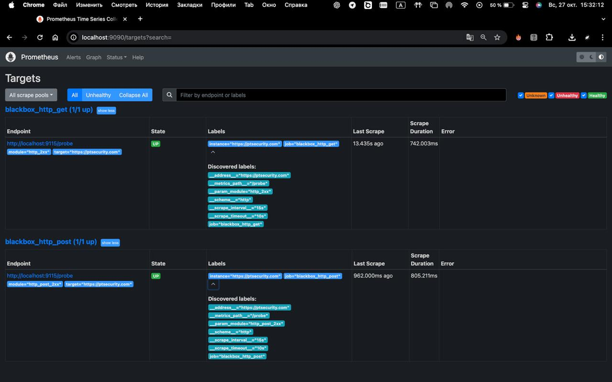

# Monitoring `ptsecurity.com` Availability with Prometheus and Blackbox Exporter

## Запуск blackbox_exporter

```bash
blackbox_exporter --config.file=blackbox.yml
```

## Запуск prometheus

```bash
prometheus --config.file=prometheus.yml
```

**Некоторые метрики доступности**


**Таргеты**



## ```blackbox.yml```

### Общая структура
Конфигурация модулей описывает, как Blackbox Exporter будет выполнять проверки доступности определённых целевых URL. Каждый модуль определяет параметры запроса, который будет отправляться к целевому ресурсу, а также условия, при которых этот запрос считается успешным.

### 1. **Модуль `http_2xx`**

- `prober: http` -  Этот параметр указывает, что для проверки доступности будет использоваться HTTP-протокол.
- `timeout: 10s` -  Время ожидания ответа от целевого сервера составляет 10 секунд. Если ответ не будет получен в течение этого времени, проверка считается неудачной.
- `valid_status_codes` - Это список кодов состояния HTTP, которые считаются успешными. В данном случае проверка будет считаться успешной, если сервер ответит с одним из следующих кодов:
  - `200`: Успешный запрос.
  - `301`: Перемещено навсегда (постоянный редирект).
  - `302`: Найдено (временный редирект).
  - `304`: Не изменялось (ресурс не изменился с момента последнего запроса).
  - `401`: Не авторизован (требуется авторизация).
  - `403`: Запрещено (доступ к ресурсу запрещён).
- **method: GET** - Указывает, что для проверки будет использоваться метод HTTP GET. Этот метод запрашивает данные с указанного URL.

### 2. **Модуль `http_post_2xx`**

- `prober: http` - Аналогично первому модулю, это указывает на использование HTTP-протокола для проверки.
- `timeout: 10s` - Время ожидания ответа от сервера также составляет 10 секунд.
- `valid_status_codes` - Список кодов состояния, которые считаются успешными, аналогичен первому модулю.
- `method: POST` - Указывает, что для проверки будет использоваться метод HTTP POST. Этот метод обычно используется для отправки данных на сервер (например, для отправки формы).

## ```prometheus.yml```

### Общая структура
Конфигурация для Prometheus включает два задания (`job`): одно для проверки доступности с помощью метода HTTP GET, другое — с помощью метода HTTP POST.

Конфигурация определяет, как Prometheus будет собирать метрики с помощью Blackbox Exporter. В ней указываются параметры, необходимые для настройки каждого задания, такие как частота опроса, целевые адреса, используемые модули и параметры переименования метрик.

### 1. **Глобальная настройка**

- `scrape_interval: 15s` -  Это глобальная настройка, которая определяет интервал опроса метрик для всех заданий. В данном случае, Prometheus будет опрашивать метрики каждые 15 секунд.

### 2. **Задание `blackbox_http_get`**

- `job_name: 'blackbox_http_get'` - Имя задания, которое используется для идентификации этого опроса в Prometheus.
- `metrics_path: /probe` - Путь, по которому Prometheus будет запрашивать метрики у Blackbox Exporter. Путь `/probe` в конфигурации Prometheus используется потому, что это стандартный API-эндпоинт Blackbox Exporter для получения данных о проверках доступности указанных URL-адресов.
- `params` - Определяет параметры, которые будут переданы Blackbox Exporter:
  - `module: [http_2xx]` - Указывает, что будет использоваться модуль `http_2xx` для проверки.
- `static_configs` - Определяет целевые адреса, которые Prometheus будет опрашивать:
  - `targets` - Здесь указывается адрес, который будет проверяться (в данном случае `https://ptsecurity.com`).
- `relabel_configs` - Эти конфигурации определяют, как будут переименовываться метрики, чтобы настроить правильное поведение:
  - `source_labels` - Использует метки из других метрик для создания новых меток.
  - `target_label: __param_target` - Устанавливает целевой адрес для проверки (в данном случае это адрес из `static_configs`).
  - `target_label: instance` - Устанавливает метку `instance`, которая будет содержать адрес целевого ресурса.
  - `replacement: localhost:9115` - Указывает адрес Blackbox Exporter, который будет использоваться для выполнения проверки. Здесь `localhost:9115` — это адрес и порт, на котором запущен Blackbox Exporter.

### 3. **Задание `blackbox_http_post`**

- `job_name: 'blackbox_http_post'` - Имя этого задания для Prometheus.
- `metrics_path: /probe` - Путь для получения метрик у Blackbox Exporter.
- `params`:
  - `module: [http_post_2xx]` - Указывает, что будет использоваться модуль `http_post_2xx` для проверки с использованием метода POST.
- `static_configs`: 
  - `targets` - Указывает адрес, который будет проверяться (также `https://ptsecurity.com`).
- `relabel_configs` - Аналогично первому заданию, настраивает переименовывание метрик.
